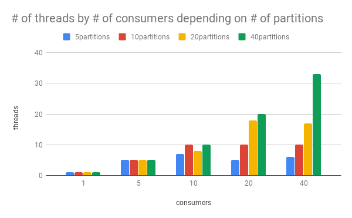
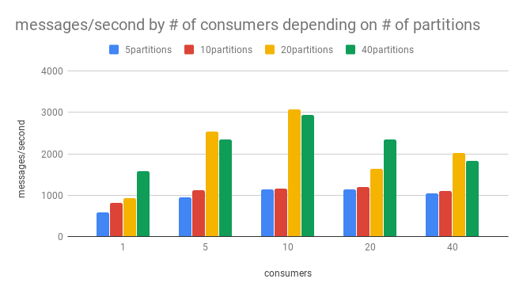

# Apache Camel Kafka Benchmark

Test using different number of partitions, consumersCount and consumerStreams.

## Run

Ensure docker app is started and ...

```bash
./shell.sh
```

Type `help` to see the available commands, and enjoy!

## Some results ...


